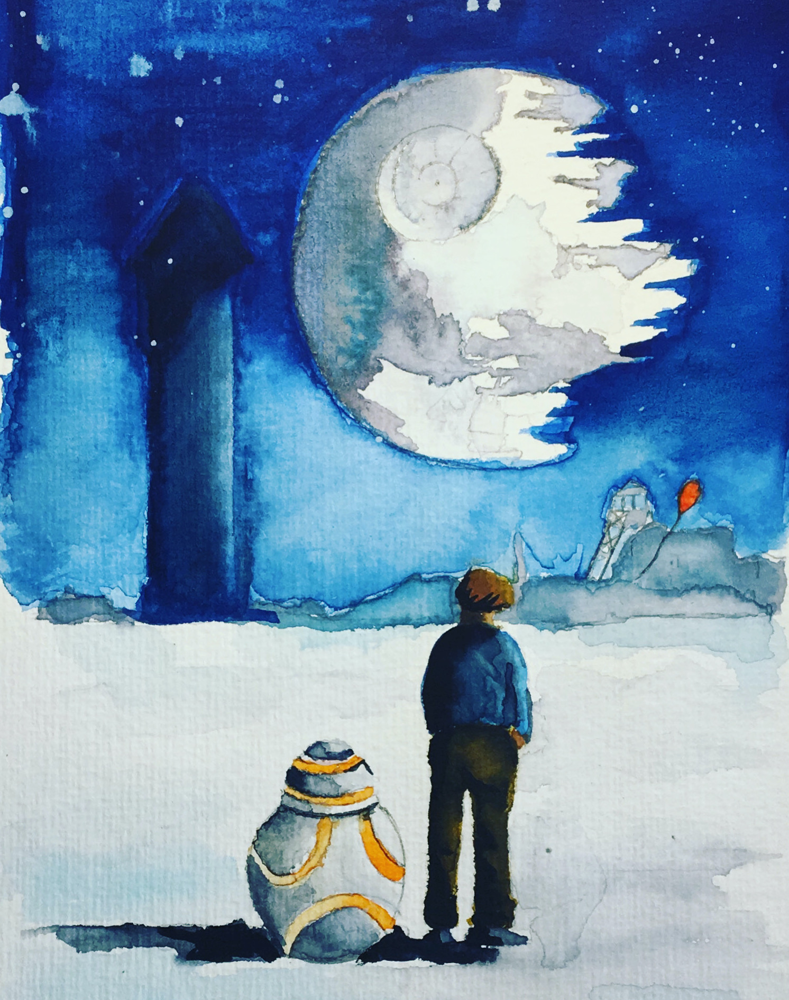
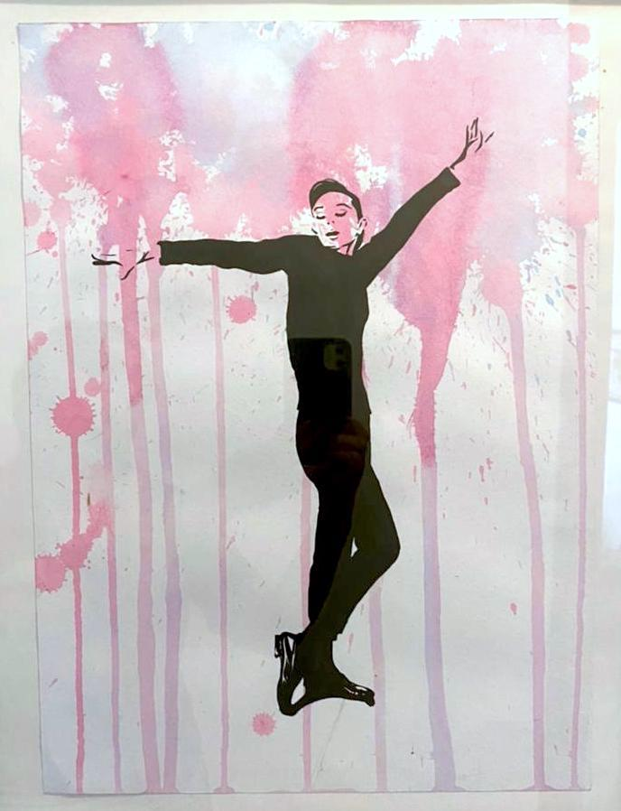
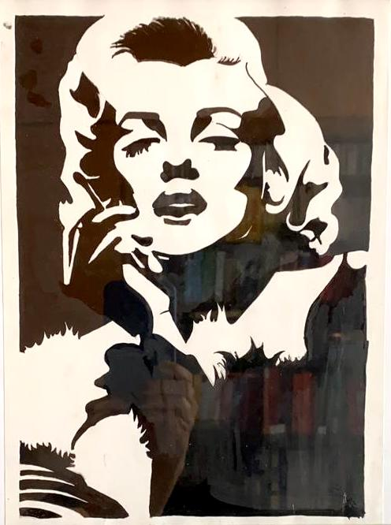
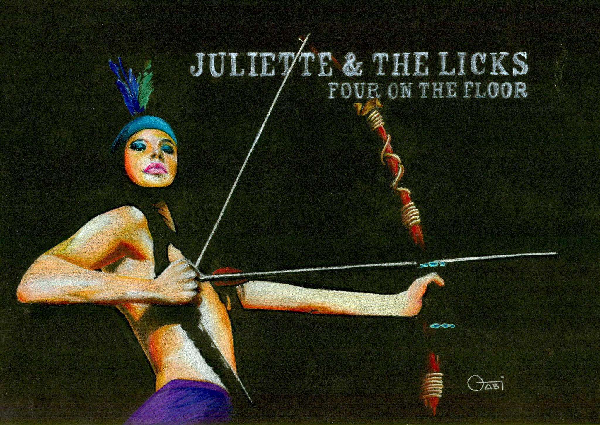

During my high school years, I studied part time at an art school back in Brazil. When I am not working on my research, drawing and paiting are hobbies that I try to keep alive up to now. 

\
*Upside down*, Watercolor

\
*Dots*, Nankin, pointillism

\
*Smashing Pumpkins*, Oil pastel

\
*The White Stripes*, Oil pastel

\
*The lady*, Graphite

\
*Star Wars*, Watercolor

\
*The little owls*, Graphite

\
*The half-invisible lady*, Hard pastel

\
*Victor van Dort*, Oil pastel

\
*Invisible clothing*, Oil pastel

\
*The lady 2*, Oil paint

\
*Audrey Hepburn*, Watercolor and oil paint

\
*Coke*, Oil paint

\
*Marilyn Monroe*, Nankin

\
*Pop Drew Barrymore*, Oil paint

\
*Juliette and the Licks*, Colored pencil

